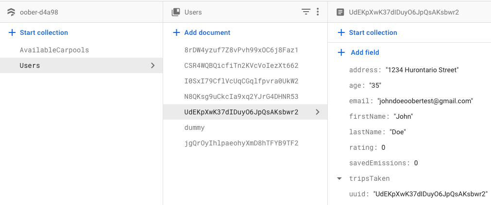
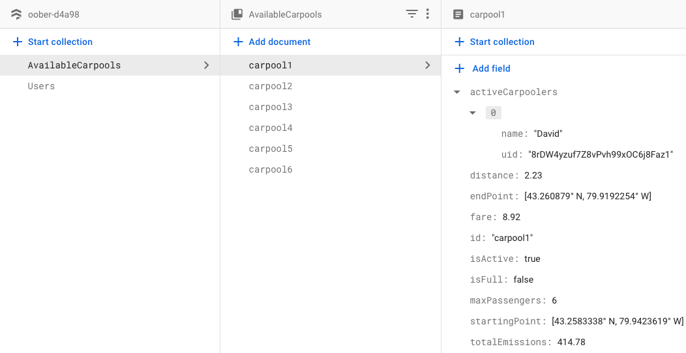

# Oober: The Green Way to Carpool :oncoming_taxi:

  

Oober is a mobile ride sharing application that groups individuals traveling to the same location into the same taxi. This will lower the cost of travel and reduce emissions for the customers of a local taxi company. Additionally, Oober will have two modes, Request Taxi Carpool, where the customer can enter their destination along with some optional search criteria and Offer Taxi Carpool, where customers can scan a QR code inside the taxi to offer the taxi they are in as a carpool. These features help us differentiate from our competitor, Uber, another similar service. However, existing services such as Uber, charge a premium to get a vehicle that seats more passengers and are overall more expensive than taxis. These services also have limits as to how many people can share a vehicle, for example, Uber allows only one other person to share a ride with you. The difference is that Oober specializes in ride sharing, collaborating with local taxi drivers, and providing customers with their carbon emission data all while helping riders meet new people and create groups that frequently carpool to further save on costs. The advantage the Oober has over existing ride-sharing solutions is that this application has a higher limit in the number of allowed passengers.

# Features :gem:
- **Saved Carbon Emissions:**
  - This feature is what makes Oober stand out from its competitors. Oober not only is focused on providing customers with low transportation costs, bit also a way to help reduce their carbon footprint in a way that *actually* makes an impact. Oober shows its users the amount of carbon emissions that were saved by taking a taxi carpool compared to driving to your destination on your own.
  
# Main Functions of Oober :dart:
  - **Creating/Managing Oober Account**
		- The Oober application will allow its users to create an account so that they can begin to use the application. It will also allow the users to update their personal information, payment method(s), viewing past carpool rides, and give users the option to delete their account if they wish to.
- **Requesting a Taxi Carpool**
	- The Oober application will allow the rider to enter their destination along with other optional filtering criteria to find a taxi carpool that best suits their needs.
- **Curate List of Potential Taxi Matches**
	- The Oober application will allow the rider to see a list of potential taxi carpool matches that are available to them (matching their criteria), showing estimated fares and saved emissions.
- **Offering a Taxi Carpool**
	- The Oober application will allow a rider to offer their taxi to other customers to create a carpool. By providing relevant ride information, the rider will then wait for any requests from other customers to join their carpool.
- **Optimize Taxi Carpool Route**
	- The Oober application will calculate the most efficient route for the taxi carpool so that riders can minimize costs and emissions. This application will also reroute any taxi if it encounters traffic or other road conditions that may affect the route.
- **Rating Customers in a Carpool**
	- The Oober application will allow the rider to rate the other customers in their carpool. This rating will be used to determine the quality of the carpool.
- **Calculating Taxi Carpool Fare**
	- The Oober application will calculate the fare for the taxi carpool based on the distance traveled and the number of passengers in the carpool.

# Prerequisites :vertical_traffic_light:
- **Setup of Android Emulator**
  - Download Android studio 
  - Follow [this](https://developer.android.com/studio/run/managing-avds#createavd) guide to setup an Android emulator
    - When asked for the following, select: 
      - Device: Pixel 6 Pro
      - Release Name: S (download if not download already)
      - In Configuration Settings -> select your webcam as the device's camera
      - Start the emulator and keep it running in the background
- **Setup of Firebase and Google Maps API** (`.env.example` is an example of the `.env` you need)
  - **Prerequisites:** Must have a Google Account 
    - Enable the Geocoding and Places API in a project from your Google Cloud Console  (get API key and update the `GOOGLE_MAPS_API_KEY1 field in your `.env` file)
    - Create an account with Firebase and create an authentication instance (using email/password method of choice) + an instance for Cloud Firestore (database). Copy your Firebase API key information, extract the information needed to populate the `.env` file.
      - Create a collection called `Users`and `AvailableCarpools` in Firestore like below (with a dummy document for setup)

  

  

# How to run Oober? :checkered_flag:
  - Clone this GitHub repository and cd into the `Oober` directory on your machine using your terminal
  - Run `npm install` to install required dependencies for Oober
  - Run `npx expo start`
  - Press `a` in your terminal from where the above command was run to start the app on your Android emulator

# Need Support? :mega:
Please send any questions or inquiries about Oober via email to 1006shrillpatel@gmail.com.

# License :scroll:
Oober is licensed under the MIT license (look into the `LICENSE` file in root directory of this repository).

# Contributions :pencil2:
- **Shrill**
  - App setup + app design + logo design
  - Login (page design + logic)
  - Registration (page design + logic)
  - Email Verification using Firebase
  - Firebase Setup + Integration
  - Google Maps API Integration 
  - Home Page (maps display, automatic search field population using Google Maps Autocomplete, dynamic change of routes and start/end markers)
  - Request Carpool
    - Available Carpools Page
  - Offer Carpool
    - Scan QR Page
    - Offer Information Page (user can edit offer)
  - User Trip History
  - Sign Out Functionality
  - Dynamic Rider Rating Page
- **Bhavana**
  - Update Account (Shrill helped by explaining how feature works and which methods to use)
  - Rider Rating (Shrill helped to make form dynamic to the riders in a specific ride and the overall feature)
- **Zhenia**
  - Delete Account (Shrill helped implement this feature by exlpaining what exactly to do, which methods to use, improved error handling because initial implementation did not function as intended)
- **Naishan**
  - Did not contribute to development
- **Jay**
  - Did not contribute to development
